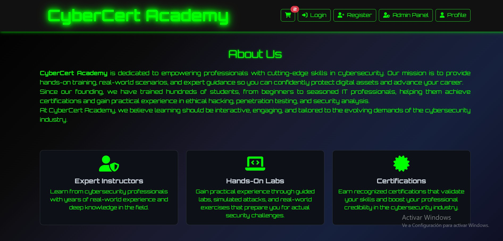

# CyberCert Academy
## 👥 Miembros del Equipo
| Nombre y Apellidos | Correo URJC | Usuario GitHub |
|:--- |:--- |:--- |
| Ricardo de Francisco Alfonso | r.defrancisco.2024@alumnos.urjc.es | rikydefco20 |
| Jaime Bonafé Macedo | j.bonafe.2024@alumnos.urjc.es | k1di3 |
| Erik Halasz | e.halasz.2024@alumnos.urjc.es | qixfnqu |
| Pablo Dominguez | p.dominguezg.2024@alumnos.urjc.es | dmngz |


---

## 🎭 **Preparación: Definición del Proyecto**

### **Descripción del Tema**
Esta web va a tratar la venta y exposición de varias certificaciones de ciberseguridad.
Desde el punto de vista de un usuario, esta página proporciona una funcionalidad personalizada de consulta de los certificados adquiridos y la habilidad de adquirir más certificados.

### **Entidades**
Indicar las entidades principales que gestionará la aplicación y las relaciones entre ellas:

1. **Usuario**
2. **Certificación**
3. **Carrito**
4. **Reseña**

**Relaciones entre entidades:**
- Cada usuario puede poseer varias certificaciones
- El carrito puede contener 1 o mas certificaciones
- Cada usuario podrá dejar multiples reseña
- Cada certificación podrá tener varias reseñas

### **Permisos de los Usuarios**
Describir los permisos de cada tipo de usuario e indicar de qué entidades es dueño:

* **Usuario Anónimo**: 
  - Permisos: Visualización de catálogo y registro
  - No es dueño de ningun certificado

* **Usuario Registrado**: 
  - Permisos: Gestión de perfil, compra de certificados, crear valoraciones, consulta de certificados adquiridos.
  - Es dueño de: De su perfil, sus certificados, de su carrito y de sus valoraciones.

* **Administrador**: 
  - Permisos: Gestion completa, acceso al panel de administracion, gestion de la base de datos
  - Es dueño de: Todo

### **Imágenes**
Indicar qué entidades tendrán asociadas una o varias imágenes:

- **Usuario**: Una imagen de perfil por cada usuario
- **Certificado**: Una imagen por certificado


---

## 🛠 **Práctica 1: Maquetación de páginas con HTML y CSS**

### **Vídeo de Demostración**
📹 **[Enlace al vídeo en YouTube](https://youtu.be/QZzmBuk9WQc)**
> Vídeo mostrando las principales funcionalidades de la aplicación web.

### **Diagrama de Navegación**
Diagrama que muestra cómo se navega entre las diferentes páginas de la aplicación:


> [El usuario puede acceder con normalidad a los distintos certificados y a las paginas de login pero para poder acceder a la pagina del carrito y del perfil necesariamente debe estar registrado. Solo el administrador podra acceder a la pagina especial de Admin Panel ]

### **Capturas de Pantalla y Descripción de Páginas**

#### **1. Página Principal / Home**


> [Esta es la pagina principal que nos permite acceder a las siguientes paginas, nos muestra los certificados, una pequeña descripcion sobre nosotros y la pagina y unas reseñas simuladas de la web.]

#### **2. Página de perfil**


> [Esta pestaña muestra el perfil del usuario, aquí verá sus datos de perfil como el nombre de usuario, email y las certificaciones que tiene, estos datos pueden ser editados por el usuario]

#### **3. Pantalla de administración**


> [El administradir de la web, a través de esta pantalla podrá gestionar tanto los usuarios como las certificaciones, pudiendo añadir o eliminar dichos objetos]

#### **4. Paneles login/register**


> [Paneles para el inicio de sisión o registro de un usuario en la web]
#### **5. Página de certificación**


> [Pagina con la descripción de la certificación con un formulario para dejar reseñas]

#### **6. Shopping cart/checkout**


> [En esta Página el usuario elige las certificaciones que quiere obtener]


> [En esta Página el usuario realiza el pago]


### **Participación de Miembros en la Práctica 1**

#### **Alumno 1 - [Ricardo de Francisco Alfonso]**
s 
[Mi trabajo se ha centrado principalmente en la creacion de index.html definiendo la estetica general de la web para las paginas posteriores. Tambien he trabajado en la creacion de todas las imagenes del proyecto y la creacion del diagrama de pantallas]

| Nº    | Commits      | Files      |
|:------------: |:------------:| :------------:|
|1| [Creacion del index](https://github.com/DWS-2026/dws-2026-project-base/commit/64587d7800cdd73db956c425924a9f5e2242bb98)  | [index.html](https://github.com/DWS-2026/project-grupo-18/blob/main/index.html)   |
|2| [Creacion del style.css principal](https://github.com/DWS-2026/dws-2026-project-base/commit/0b02a4892e77d2e1acad7bb805b198f2b12fe7db)  | [style.css](https://github.com/DWS-2026/project-grupo-18/blob/main/assets/css/style.css)   |
|3| [Mejora auth.css](https://github.com/DWS-2026/dws-2026-project-base/commit/6d9fae0f9fe6ccf4db309c32413f6ef67dce9362)  | [auth.css](https://github.com/DWS-2026/project-grupo-18/blob/main/assets/css/auth.css)   |
|4| [Cambio estilos en el perfil](URL_commit_4)  | [profile.css](https://github.com/DWS-2026/project-grupo-18/blob/main/assets/css/profile.css)   |


---

#### **Alumno 2 - [Jaime Bonafé Macedo]**

[Me encargué de crear el panel de administración, la pantalla de registro y el perfil de usuario, con ello tambíén se creó los archivos css correspondientes]

| Nº    | Commits      | Files      |
|:------------: |:------------:| :------------:|
|1| [Add profile html](https://github.com/DWS-2026/dws-2026-project-base/commit/0bbfb85a39382781e65a01c9d3fb27492a749bce)  | [profile.html](https://github.com/DWS-2026/project-grupo-18/blob/main/pages/profile.html)   |
|2| [Admin panel added](https://github.com/DWS-2026/dws-2026-project-base/commit/90bc1bf51c2192e56e4c28121326c942942b7b27)  | [Admin.html](https://github.com/DWS-2026/project-grupo-18/blob/main/pages/admin.html)   |
|3| [auth.css added with register.html and updated login.html](https://github.com/DWS-2026/dws-2026-project-base/commit/b1be59d387e24f5579b865d0440fb4491e454d1e)  | [auth.css, login.html, register.html](https://github.com/DWS-2026/project-grupo-18/blob/main/pages/register.html)   |

---

#### **Alumno 3 - [Erik Halasz]**

[Mi tarea principal ha sido la creación de la pagina certification.html, pero también hice retoques importantes a la estructira general de los estilos, creación de un header y footer comunes para cada página y archivos de css]

| Nº    | Commits      | Files      |
|:------------: |:------------:| :------------:|
|1| [Added certifications page, updated general css and structure](https://github.com/DWS-2026/project-grupo-18/commit/008cf7c9de081120ca0f2df1f7c6c00b69fa8108)  | [certification.html](https://github.com/DWS-2026/project-grupo-18/blob/main/pages/certification.html)   |
|2| [Update index.html](https://github.com/DWS-2026/project-grupo-18/commit/767df3a62c0d7f387154c50dba0ec4d8c431731e)  | [index.html](https://github.com/DWS-2026/project-grupo-18/blob/main/index.html)   |
|3| [Add review section](https://github.com/DWS-2026/project-grupo-18/commit/a655eae95cd2ae3db414a96e456dc29d7f7737df)  | [certification.html](https://github.com/DWS-2026/project-grupo-18/blob/main/pages/certification.html)   |
|4| [Update header in shopping cart and index.html](https://github.com/DWS-2026/project-grupo-18/commit/d608c2a3151b1d77177e4c8aea15ccb739a9a4e4) | [shopping-cart.html](https://github.com/DWS-2026/project-grupo-18/blob/main/pages/shopping-cart.html)  |

---

#### **Alumno 4 - [Pablo Domínguez]**

[Mi tarea principal fue encargarme de la creación del carrito y de la pantalla de pago, y también de hacer el video de demostración de la pagina web]

| Nº    | Commits      | Files      |
|:------------: |:------------:| :------------:|
|1| [Shopping cart creation](URL_commit_1)  | [shopping-cart.html](https://github.com/DWS-2026/project-grupo-18/blob/main/pages/shopping-cart.html)   |
|2| [Shopping cart style](URL_commit_2)  | [shopping-cart.css(https://github.com/DWS-2026/project-grupo-18/blob/main/pages/shopping-cart.css)   |
|3| [Checkout style](URL_commit_3)  | [checkout.css](https://github.com/DWS-2026/project-grupo-18/blob/main/pages/checkout.css)   |
|4| [Checkout creation](URL_commit_4)  | [checkout.html](https://github.com/DWS-2026/project-grupo-18/blob/main/pages/checkout.html)   |
|5| [Demostration video](URL_commit_5)  | [Archivo5](https://youtu.be/QZzmBuk9WQc)   |

---

## 🛠 **Práctica 2: Web con HTML generado en servidor**

### **Vídeo de Demostración**
📹 **[Enlace al vídeo en YouTube](https://www.youtube.com/watch?v=x91MPoITQ3I)**
> Vídeo mostrando las principales funcionalidades de la aplicación web.


#### **Capturas de Pantalla Actualizadas**

Solo si han cambiado.

### **Instrucciones de Ejecución**

#### **Requisitos Previos**
- **Java**: versión 21 o superior
- **Maven**: versión 3.8 o superior
- **MySQL**: versión 8.0 o superior
- **Git**: para clonar el repositorio

#### **Pasos para ejecutar la aplicación**

1. **Clonar el repositorio**
   ```bash
   git clone https://github.com/[usuario]/[nombre-repositorio].git
   cd [nombre-repositorio]
   ```

2. **AQUÍ INDICAR LO SIGUIENTES PASOS**

#### **Credenciales de prueba**
- **Usuario Admin**: usuario: `admin`, contraseña: `admin123`
- **Usuario Registrado**: usuario: `user`, contraseña: `user123`

### **Diagrama de Entidades de Base de Datos**

Diagrama mostrando las entidades, sus campos y relaciones:


> [Descripción opcional: Ej: "El diagrama muestra las 4 entidades principales: Usuario, Producto, Pedido y Categoría, con sus respectivos atributos y relaciones 1:N y N:M."]

### **Diagrama de Clases y Templates**

Diagrama de clases de la aplicación con diferenciación por colores o secciones:


> [Descripción opcional del diagrama y relaciones principales]

### **Participación de Miembros en la Práctica 2**

#### **Alumno 1 - [Ricardo de Francisco Alfonso]**

[Mi trabajo generalmente ha consistido en migrar el proyecto a Spring, configurar la seguridad y otros detalles como la entidad User y funcionalidades de páginas específicas.]

| Nº    | Commits      | Files      |
|:------------: |:------------:| :------------:|
|1| [Paso del proyecto a springboot, creacion del controlador y configuracion de pom.xml](https://github.com/DWS-2026/project-grupo-18/commit/1b97b32596e6c1d03806c7a7c34c53165920d571)  | [CyberController.java](https://github.com/DWS-2026/project-grupo-18/blob/main/src/main/java/com/example/cybercert/Controllers/CyberController.java)   |
|2| [Seguridad de la web con la creacion de SecurityConfig](https://github.com/DWS-2026/project-grupo-18/commit/55f53120b1f9b15e80d410fb6c06f570a8b94957)  | [SecurityConfiguration.java](https://github.com/DWS-2026/project-grupo-18/blob/main/src/main/java/com/example/cybercert/SecurityConfiguration.java)   |
|3| [Fotos de perfil de usuarios](https://github.com/DWS-2026/project-grupo-18/commit/4679f3521299412c30f920a3bd08f0a25d821a68)  | [UserController](https://github.com/DWS-2026/project-grupo-18/blob/main/src/main/java/com/example/cybercert/Controllers/UserController.java)   |
|4| [Creacion de BBDD provisional en h2 y logica de usuarios](https://github.com/DWS-2026/project-grupo-18/commit/d0cf22d9ab56f9decefbcb78850002db9556969d)  | [User.java](https://github.com/DWS-2026/project-grupo-18/blob/main/src/main/java/com/example/cybercert/Models/User.java)   |
|5| [Creacion de paginas de error con un estilo concorde a la web](https://github.com/DWS-2026/project-grupo-18/commit/12eaa7d0e530b0e0082ce3a41d6fa24a721cc44e)  | [403.css](https://github.com/DWS-2026/project-grupo-18/blob/main/src/main/resources/static/assets/css/403.css)   |

---

#### **Alumno 2 - Jaime Bonafé Macedo**

[Me he encargado de la reestructuración del proyecto, implementación de tokens csrf, y lógica de backend del perfil,comentarios,admin panel etc.]

| Nº    | Commits      | Files      |
|:------------: |:------------:| :------------:|
|1| [Better structure of everything](https://github.com/DWS-2026/dws-2026-project-base/commit/f21e21612e4cb793cb84086558b17f5a04457245)  | [All](https://github.com/DWS-2026/project-grupo-18/)   |
|2| [Comment section added and services for users,comments and certifications too](https://github.com/DWS-2026/dws-2026-project-base/commit/9ed546fc7d946207b66efc1e37dcaef85304c7b3)  | [CertificationService.java](https://github.com/DWS-2026/project-grupo-18/blob/main/src/main/java/com/example/cybercert/Services/CertificationService.java), [Comment.java](https://github.com/DWS-2026/project-grupo-18/blob/main/src/main/java/com/example/cybercert/Models/Comment.java), [CommentService.java](https://github.com/DWS-2026/project-grupo-18/blob/main/src/main/java/com/example/cybercert/Services/CommentService.java), [CommentsRepository.java](https://github.com/DWS-2026/project-grupo-18/blob/main/src/main/java/com/example/cybercert/Repositories/CommentsRepository.java)  |
|3| [Admin can now view users on admin panel](https://github.com/DWS-2026/dws-2026-project-base/commit/405cf922379af5581fde138454c577a33d92564e)  | [AdminController.java](https://github.com/DWS-2026/project-grupo-18/blob/main/src/main/java/com/example/cybercert/Controllers/AdminController.java)   |
|4| [Solved the problem with csrf tokens and with duplicate email registration](https://github.com/DWS-2026/dws-2026-project-base/commit/9ae458cd6c63372fd74fd309439e58f5d26eca91)  | [CyberController.java](https://github.com/DWS-2026/project-grupo-18/blob/main/src/main/java/com/example/cybercert/Controllers/CyberController.java)   |
|5| [added basic logic for editing profile](https://github.com/DWS-2026/dws-2026-project-base/commit/c96251a184e7ca3304d41ed5fa8d04cb4d06c49e)  | [CyberController.java](https://github.com/DWS-2026/project-grupo-18/blob/main/src/main/java/com/example/cybercert/Controllers/CyberController.java)   |


---

#### **Alumno 3 - Erik Halasz**

[Me he encargado de gestionar toda la parte de manipulacion de la entidad certificación, gestión de las imágenes en la web, y detalles varios, como scripts básicos en el frontend y ajustes en el html]

| Nº    | Commits      | Files      |
|:------------: |:------------:| :------------:|
|1| [Added dynamic implementation of the certification page and integration to the database](https://github.com/DWS-2026/project-grupo-18/commit/f801751a2926666c48bcbc8276399850e1bb553e)  | [Certification.java](https://github.com/DWS-2026/project-grupo-18/blob/main/src/main/java/com/example/cybercert/Models/Certification.java)   |
|2| [Added Image handling in database and Image Controller](https://github.com/DWS-2026/project-grupo-18/commit/62b2c848161ce77e398f3ef126d5ab18f503050a) | [ImageController.java](https://github.com/DWS-2026/project-grupo-18/blob/main/src/main/java/com/example/cybercert/Controllers/ImageController.java)   |
|3| [Migrate to SQL with Docker](https://github.com/DWS-2026/project-grupo-18/commit/fa906e9d608b57d4ecdbb544e11ffd8b41b05aa1)  | [application.properties](https://github.com/DWS-2026/project-grupo-18/blob/main/src/main/resources/application.properties)   |
|4| [Make dynamic profile render](https://github.com/DWS-2026/project-grupo-18/commit/8512ea865728fb9995bd8402876e66003ca8e184)  | [profile.html](https://github.com/DWS-2026/project-grupo-18/blob/main/src/main/resources/templates/profile.html)   |
|5| [Implemented Add Certification and Delete Certification Functionality in admin panel](https://github.com/DWS-2026/project-grupo-18/commit/15ba1bcdc1459342172e5c857012f4bec6a82ea0)  | [AdminController.java](https://github.com/DWS-2026/project-grupo-18/blob/main/src/main/java/com/example/cybercert/Controllers/AdminController.java)  |

---

#### **Alumno 4 - [Nombre Completo]**

[Descripción de las tareas y responsabilidades principales del alumno en el proyecto]

| Nº    | Commits      | Files      |
|:------------: |:------------:| :------------:|
|1| [Descripción commit 1](URL_commit_1)  | [Archivo1](URL_archivo_1)   |
|2| [Descripción commit 2](URL_commit_2)  | [Archivo2](URL_archivo_2)   |
|3| [Descripción commit 3](URL_commit_3)  | [Archivo3](URL_archivo_3)   |
|4| [Descripción commit 4](URL_commit_4)  | [Archivo4](URL_archivo_4)   |
|5| [Descripción commit 5](URL_commit_5)  | [Archivo5](URL_archivo_5)   |

---

## 🛠 **Práctica 3: Incorporación de una API REST a la aplicación web, análisis de vulnerabilidades y contramedidas**

### **Vídeo de Demostración**
📹 **[Enlace al vídeo en YouTube](https://www.youtube.com/watch?v=x91MPoITQ3I)**
> Vídeo mostrando las principales funcionalidades de la aplicación web.

### **Documentación de la API REST**

#### **Especificación OpenAPI**
📄 **[Especificación OpenAPI (YAML)](/api-docs/api-docs.yaml)**

#### **Documentación HTML**
📖 **[Documentación API REST (HTML)](https://raw.githack.com/[usuario]/[repositorio]/main/api-docs/api-docs.html)**

> La documentación de la API REST se encuentra en la carpeta `/api-docs` del repositorio. Se ha generado automáticamente con SpringDoc a partir de las anotaciones en el código Java.

### **Diagrama de Clases y Templates Actualizado**

Diagrama actualizado incluyendo los @RestController y su relación con los @Service compartidos:


#### **Credenciales de Usuarios de Ejemplo**

| Rol | Usuario | Contraseña |
|:---|:---|:---|
| Administrador | admin | admin123 |
| Usuario Registrado | user1 | user123 |
| Usuario Registrado | user2 | user123 |

### **Participación de Miembros en la Práctica 3**

#### **Alumno 1 - [Nombre Completo]**

[Descripción de las tareas y responsabilidades principales del alumno en el proyecto]

| Nº    | Commits      | Files      |
|:------------: |:------------:| :------------:|
|1| [Descripción commit 1](URL_commit_1)  | [Archivo1](URL_archivo_1)   |
|2| [Descripción commit 2](URL_commit_2)  | [Archivo2](URL_archivo_2)   |
|3| [Descripción commit 3](URL_commit_3)  | [Archivo3](URL_archivo_3)   |
|4| [Descripción commit 4](URL_commit_4)  | [Archivo4](URL_archivo_4)   |
|5| [Descripción commit 5](URL_commit_5)  | [Archivo5](URL_archivo_5)   |

---

#### **Alumno 2 - [Nombre Completo]**

[Descripción de las tareas y responsabilidades principales del alumno en el proyecto]

| Nº    | Commits      | Files      |
|:------------: |:------------:| :------------:|
|1| [Descripción commit 1](URL_commit_1)  | [Archivo1](URL_archivo_1)   |
|2| [Descripción commit 2](URL_commit_2)  | [Archivo2](URL_archivo_2)   |
|3| [Descripción commit 3](URL_commit_3)  | [Archivo3](URL_archivo_3)   |
|4| [Descripción commit 4](URL_commit_4)  | [Archivo4](URL_archivo_4)   |
|5| [Descripción commit 5](URL_commit_5)  | [Archivo5](URL_archivo_5)   |

---

#### **Alumno 3 - [Nombre Completo]**

[Descripción de las tareas y responsabilidades principales del alumno en el proyecto]

| Nº    | Commits      | Files      |
|:------------: |:------------:| :------------:|
|1| [Descripción commit 1](URL_commit_1)  | [Archivo1](URL_archivo_1)   |
|2| [Descripción commit 2](URL_commit_2)  | [Archivo2](URL_archivo_2)   |
|3| [Descripción commit 3](URL_commit_3)  | [Archivo3](URL_archivo_3)   |
|4| [Descripción commit 4](URL_commit_4)  | [Archivo4](URL_archivo_4)   |
|5| [Descripción commit 5](URL_commit_5)  | [Archivo5](URL_archivo_5)   |

---

#### **Alumno 4 - [Nombre Completo]**

[Descripción de las tareas y responsabilidades principales del alumno en el proyecto]

| Nº    | Commits      | Files      |
|:------------: |:------------:| :------------:|
|1| [Descripción commit 1](URL_commit_1)  | [Archivo1](URL_archivo_1)   |
|2| [Descripción commit 2](URL_commit_2)  | [Archivo2](URL_archivo_2)   |
|3| [Descripción commit 3](URL_commit_3)  | [Archivo3](URL_archivo_3)   |
|4| [Descripción commit 4](URL_commit_4)  | [Archivo4](URL_archivo_4)   |
|5| [Descripción commit 5](URL_commit_5)  | [Archivo5](URL_archivo_5)   |
